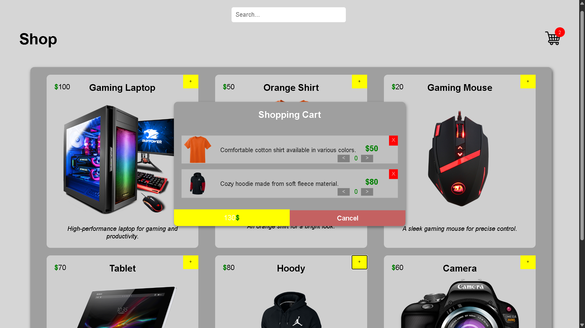

# Shop Page 🛒

A fully functional e-commerce product page built with HTML, CSS & Vanilla JavaScript — no frameworks, no tutorials, just pure logic.

## Features
- 6 dynamic products rendered from JavaScript objects
- Add to cart with one click
- Prevent adding the same product twice 🚫
- Product image, description & price displayed in cart
- Quantity system (+ and -) per item
- Real-time total price calculation 💰
- Cart counter updates automatically
- Cart saves after page refresh (localStorage) 💾
- Clean and organized code structure

## Built With
- HTML
- CSS
- Vanilla JavaScript

## Preview

## Key Concepts Used
- DOM manipulation
- Data attributes (`data-product`)
- Object-based data structures
- localStorage + JSON
- Array methods (find, filter, forEach, reduce)
- Dynamic event listeners

## Live Demo
Coming soon...
